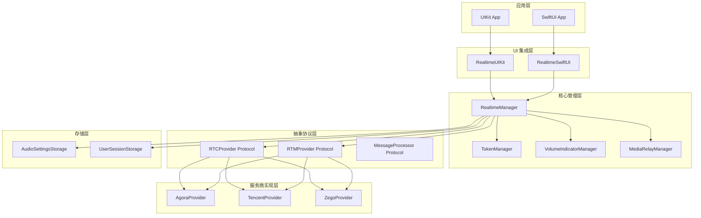
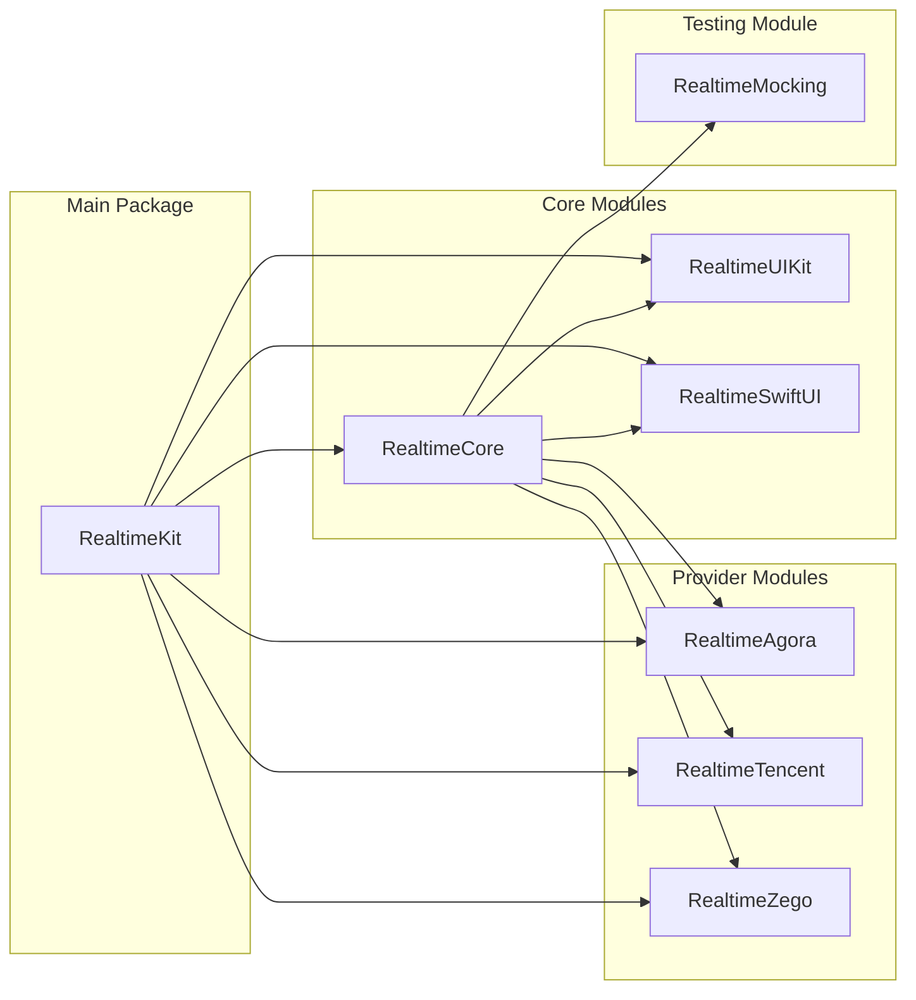

# RealtimeKit Swift Package 设计文档

## 概述

RealtimeKit 是一个模块化的 Swift Package，采用协议导向编程和插件化架构，为 iOS/macOS 应用提供统一的实时通信解决方案。该设计文档基于 16 个核心需求，重点关注可扩展性、性能优化、类型安全和现代 Swift 特性的充分利用。

### 设计原则

1. **统一 API 接口**: 通过 RTCProvider 和 RTMProvider 协议屏蔽不同服务商差异（需求 1）
2. **插件化架构**: 支持多服务商动态切换和扩展（需求 2）
3. **响应式设计**: 全面支持 SwiftUI 和 UIKit 双框架（需求 11, 15）
4. **现代并发**: 全面采用 Swift Concurrency (async/await, actors)（需求 15）
5. **模块化设计**: 支持按需导入和独立模块管理（需求 12）


## 架构设计

### 整体架构



### 模块依赖关系



### 平台和版本支持

**设计决策**: 基于需求 15 的平台兼容性要求，系统支持：
- **iOS**: 13.0+ (支持 SwiftUI 和现代 Swift 特性)
- **macOS**: 10.15+ (Catalyst 和原生 macOS 应用支持)
- **Swift**: 6.2+ (全面支持 Swift Concurrency 和 Structured Concurrency)
- **框架兼容**: UIKit 和 SwiftUI 双框架支持，可在同一应用中混合使用

## 组件和接口设计

### 1. 核心协议设计

#### RTCProvider 协议
```swift
public protocol RTCProvider: AnyObject {
    // 基础生命周期
    func initialize(config: RTCConfig) async throws
    func createRoom(roomId: String) async throws -> RTCRoom
    func joinRoom(roomId: String, userId: String, userRole: UserRole) async throws
    func leaveRoom() async throws
    func switchUserRole(_ role: UserRole) async throws
    
    // 音频流控制
    func muteMicrophone(_ muted: Bool) async throws
    func isMicrophoneMuted() -> Bool
    func stopLocalAudioStream() async throws
    func resumeLocalAudioStream() async throws
    func isLocalAudioStreamActive() -> Bool
    
    // 音量控制
    func setAudioMixingVolume(_ volume: Int) async throws
    func getAudioMixingVolume() -> Int
    func setPlaybackSignalVolume(_ volume: Int) async throws
    func getPlaybackSignalVolume() -> Int
    func setRecordingSignalVolume(_ volume: Int) async throws
    func getRecordingSignalVolume() -> Int
    
    // 转推流功能
    func startStreamPush(config: StreamPushConfig) async throws
    func stopStreamPush() async throws
    func updateStreamPushLayout(layout: StreamLayout) async throws
    
    // 跨媒体流功能
    func startMediaRelay(config: MediaRelayConfig) async throws
    func stopMediaRelay() async throws
    func updateMediaRelayChannels(config: MediaRelayConfig) async throws
    func pauseMediaRelay(toChannel: String) async throws
    func resumeMediaRelay(toChannel: String) async throws
    
    // 音量指示器功能
    func enableVolumeIndicator(config: VolumeDetectionConfig) async throws
    func disableVolumeIndicator() async throws
    func setVolumeIndicatorHandler(_ handler: @escaping ([UserVolumeInfo]) -> Void)
    func setVolumeEventHandler(_ handler: @escaping (VolumeEvent) -> Void)
    func getCurrentVolumeInfos() -> [UserVolumeInfo]
    func getVolumeInfo(for userId: String) -> UserVolumeInfo?
    
    // Token 管理
    func renewToken(_ newToken: String) async throws
    func onTokenWillExpire(_ handler: @escaping (Int) -> Void)
}
```

#### RTMProvider 协议
```swift
public protocol RTMProvider: AnyObject {
    func initialize(config: RTMConfig) async throws
    func sendMessage(_ message: RealtimeMessage) async throws
    func subscribe(to channel: String) async throws
    
    // 消息处理功能 (需求 10)
    func setMessageHandler(_ handler: @escaping (RealtimeMessage) -> Void)
    func setConnectionStateHandler(_ handler: @escaping (ConnectionState) -> Void)
    func processIncomingMessage(_ rawMessage: Any) async throws -> RealtimeMessage
    func registerMessageProcessor<T: MessageProcessor>(_ processor: T) throws
    func unregisterMessageProcessor(for messageType: String) throws
    
    // Token 管理 (需求 9)
    func renewToken(_ newToken: String) async throws
    func onTokenWillExpire(_ handler: @escaping (Int) -> Void)
}

// 消息处理器协议 (需求 10.2, 10.3)
public protocol MessageProcessor: AnyObject {
    var supportedMessageTypes: [String] { get }
    func canProcess(_ message: RealtimeMessage) -> Bool
    func process(_ message: RealtimeMessage) async throws -> MessageProcessingResult
    func handleProcessingError(_ error: Error, for message: RealtimeMessage) async -> MessageProcessingResult
}

public enum MessageProcessingResult {
    case processed(RealtimeMessage?)
    case failed(Error)
    case skipped
    case retry(after: TimeInterval)
}
```

### 2. 数据模型设计

#### 用户角色和权限系统 (需求 4)
```swift
public enum UserRole: String, CaseIterable, Codable {
    case broadcaster = "broadcaster"    // 主播
    case audience = "audience"         // 观众
    case coHost = "co_host"           // 连麦嘉宾
    case moderator = "moderator"      // 主持人
    
    public var displayName: String {
        switch self {
        case .broadcaster: return "主播"
        case .audience: return "观众"
        case .coHost: return "连麦嘉宾"
        case .moderator: return "主持人"
        }
    }
    
    // 权限检查方法 (需求 4.2, 4.5)
    public var hasAudioPermission: Bool {
        switch self {
        case .broadcaster, .coHost, .moderator: return true
        case .audience: return false
        }
    }
    
    public var hasVideoPermission: Bool {
        switch self {
        case .broadcaster, .coHost: return true
        case .audience, .moderator: return false
        }
    }
    
    public var canSwitchToRole: Set<UserRole> {
        switch self {
        case .broadcaster: return [.moderator]
        case .audience: return [.coHost]
        case .coHost: return [.audience, .broadcaster]
        case .moderator: return [.broadcaster]
        }
    }
}

// 用户会话模型 (需求 4.4)
public struct UserSession: Codable, Equatable {
    let userId: String
    let userName: String
    let userRole: UserRole
    let roomId: String?
    let joinTime: Date
    let lastActiveTime: Date
    
    public init(userId: String, userName: String, userRole: UserRole, roomId: String? = nil) {
        self.userId = userId
        self.userName = userName
        self.userRole = userRole
        self.roomId = roomId
        self.joinTime = Date()
        self.lastActiveTime = Date()
    }
}
```

#### 音频设置模型 (需求 5)
```swift
public struct AudioSettings: Codable, Equatable {
    let microphoneMuted: Bool                // 需求 5.1
    let audioMixingVolume: Int              // 0-100, 需求 5.2
    let playbackSignalVolume: Int           // 0-100, 需求 5.2
    let recordingSignalVolume: Int          // 0-100, 需求 5.2
    let localAudioStreamActive: Bool        // 需求 5.3
    let lastModified: Date                  // 用于同步检测
    
    public init(
        microphoneMuted: Bool = false,
        audioMixingVolume: Int = 100,
        playbackSignalVolume: Int = 100,
        recordingSignalVolume: Int = 100,
        localAudioStreamActive: Bool = true
    ) {
        self.microphoneMuted = microphoneMuted
        self.audioMixingVolume = max(0, min(100, audioMixingVolume))
        self.playbackSignalVolume = max(0, min(100, playbackSignalVolume))
        self.recordingSignalVolume = max(0, min(100, recordingSignalVolume))
        self.localAudioStreamActive = localAudioStreamActive
        self.lastModified = Date()
    }
    
    // 设置更新方法 (需求 5.4, 5.6)
    public func withUpdatedVolume(
        audioMixing: Int? = nil,
        playbackSignal: Int? = nil,
        recordingSignal: Int? = nil
    ) -> AudioSettings {
        return AudioSettings(
            microphoneMuted: self.microphoneMuted,
            audioMixingVolume: audioMixing ?? self.audioMixingVolume,
            playbackSignalVolume: playbackSignal ?? self.playbackSignalVolume,
            recordingSignalVolume: recordingSignal ?? self.recordingSignalVolume,
            localAudioStreamActive: self.localAudioStreamActive
        )
    }
    
    public static let `default` = AudioSettings()
}
```

#### 音量检测配置 (需求 6)
```swift
public struct VolumeDetectionConfig: Codable, Equatable {
    let detectionInterval: Int      // 检测间隔（毫秒）, 需求 6.1
    let speakingThreshold: Float    // 说话音量阈值 (0.0 - 1.0), 需求 6.1
    let silenceThreshold: Float     // 静音音量阈值
    let includeLocalUser: Bool      // 是否包含本地用户
    let smoothFactor: Float         // 平滑处理参数, 需求 6.6
    
    public init(
        detectionInterval: Int = 300,
        speakingThreshold: Float = 0.3,
        silenceThreshold: Float = 0.05,
        includeLocalUser: Bool = true,
        smoothFactor: Float = 0.3
    ) {
        self.detectionInterval = max(100, min(5000, detectionInterval))
        self.speakingThreshold = max(0.0, min(1.0, speakingThreshold))
        self.silenceThreshold = max(0.0, min(1.0, silenceThreshold))
        self.includeLocalUser = includeLocalUser
        self.smoothFactor = max(0.0, min(1.0, smoothFactor))
    }
    
    public static let `default` = VolumeDetectionConfig()
}

// 音量信息模型 (需求 6.2)
public struct UserVolumeInfo: Codable, Equatable {
    let userId: String
    let volume: Float               // 0.0 - 1.0
    let isSpeaking: Bool
    let timestamp: Date
    
    public init(userId: String, volume: Float, isSpeaking: Bool, timestamp: Date = Date()) {
        self.userId = userId
        self.volume = max(0.0, min(1.0, volume))
        self.isSpeaking = isSpeaking
        self.timestamp = timestamp
    }
}

// 音量事件类型 (需求 6.3)
public enum VolumeEvent {
    case userStartedSpeaking(userId: String, volume: Float)
    case userStoppedSpeaking(userId: String, volume: Float)
    case dominantSpeakerChanged(userId: String?)
    case volumeUpdate([UserVolumeInfo])
}
```

### 3. 服务商管理和切换设计 (需求 2)

#### 服务商抽象层设计
```swift
public enum ProviderType: String, CaseIterable {
    case agora = "agora"
    case tencent = "tencent"
    case zego = "zego"
    case mock = "mock"  // 用于测试
}

// 服务商工厂 (需求 2.2)
public protocol ProviderFactory {
    func createRTCProvider() -> RTCProvider
    func createRTMProvider() -> RTMProvider
    func supportedFeatures() -> Set<ProviderFeature>
}

public enum ProviderFeature: String, CaseIterable {
    case audioStreaming = "audio_streaming"
    case videoStreaming = "video_streaming"
    case streamPush = "stream_push"
    case mediaRelay = "media_relay"
    case volumeIndicator = "volume_indicator"
    case messageProcessing = "message_processing"
}

// 服务商切换管理器 (需求 2.3, 2.4)
@MainActor
public class ProviderSwitchManager: ObservableObject {
    @Published public private(set) var currentProvider: ProviderType = .agora
    @Published public private(set) var availableProviders: [ProviderType] = []
    @Published public private(set) var switchingInProgress: Bool = false
    
    private var providerFactories: [ProviderType: ProviderFactory] = [:]
    private var fallbackChain: [ProviderType] = [.agora, .mock]
    
    public func registerProvider(_ type: ProviderType, factory: ProviderFactory) {
        providerFactories[type] = factory
        if !availableProviders.contains(type) {
            availableProviders.append(type)
        }
    }
    
    public func switchProvider(to newProvider: ProviderType, preserveSession: Bool = true) async throws {
        guard availableProviders.contains(newProvider) else {
            throw RealtimeError.providerNotAvailable(newProvider)
        }
        
        switchingInProgress = true
        defer { switchingInProgress = false }
        
        // 实现平滑切换逻辑
        try await performProviderSwitch(to: newProvider, preserveSession: preserveSession)
        currentProvider = newProvider
    }
    
    private func performProviderSwitch(to newProvider: ProviderType, preserveSession: Bool) async throws {
        // 保存当前状态
        let currentSession = RealtimeManager.shared.currentSession
        let currentAudioSettings = RealtimeManager.shared.audioSettings
        
        // 切换到新服务商
        try await RealtimeManager.shared.configure(provider: newProvider, config: RealtimeManager.shared.currentConfig)
        
        // 恢复状态
        if preserveSession, let session = currentSession {
            try await RealtimeManager.shared.restoreSession(session)
        }
        
        try await RealtimeManager.shared.applyAudioSettings(currentAudioSettings)
    }
}
```

### 4. 管理器架构设计

#### RealtimeManager 核心设计 (需求 3)
```swift
@MainActor
public class RealtimeManager: ObservableObject {
    public static let shared = RealtimeManager()
    
    // MARK: - Published Properties for SwiftUI (需求 3.2, 11.3)
    @Published public private(set) var currentSession: UserSession?
    @Published public private(set) var audioSettings: AudioSettings = .default
    @Published public private(set) var connectionState: ConnectionState = .disconnected
    @Published public private(set) var streamPushState: StreamPushState = .stopped
    @Published public private(set) var mediaRelayState: MediaRelayState?
    @Published public private(set) var volumeInfos: [UserVolumeInfo] = []
    @Published public private(set) var speakingUsers: Set<String> = []
    @Published public private(set) var dominantSpeaker: String? = nil
    
    // MARK: - Private Properties
    private let settingsStorage = AudioSettingsStorage()
    private let sessionStorage = UserSessionStorage()
    private let tokenManager = TokenManager()
    private let volumeManager = VolumeIndicatorManager()
    private let mediaRelayManager = MediaRelayManager()
    private let providerSwitchManager = ProviderSwitchManager()
    private let messageProcessingManager = MessageProcessingManager()
    
    private var rtcProvider: RTCProvider!
    private var rtmProvider: RTMProvider!
    internal var currentConfig: RealtimeConfig!
    
    // MARK: - Configuration (需求 3.1)
    public func configure(provider: ProviderType, config: RealtimeConfig) async throws {
        currentConfig = config
        
        // 使用工厂模式创建服务商实例 (需求 2.2)
        guard let factory = providerSwitchManager.providerFactories[provider] else {
            throw RealtimeError.providerNotAvailable(provider)
        }
        
        rtcProvider = factory.createRTCProvider()
        rtmProvider = factory.createRTMProvider()
        
        try await rtcProvider.initialize(config: RTCConfig(from: config))
        try await rtmProvider.initialize(config: RTMConfig(from: config))
        
        setupTokenManagement()
        setupVolumeIndicator()
        setupMessageProcessing()
        
        // 恢复设置 (需求 3.5)
        await restorePersistedSettings()
    }
    
    // MARK: - Session Management (需求 4)
    public func loginUser(userId: String, userName: String, userRole: UserRole) async throws {
        let session = UserSession(userId: userId, userName: userName, userRole: userRole)
        
        // 验证角色权限
        guard userRole.hasAudioPermission || userRole == .audience else {
            throw RealtimeError.insufficientPermissions(userRole)
        }
        
        currentSession = session
        sessionStorage.saveUserSession(session)
        
        // 根据角色配置音频权限
        if userRole.hasAudioPermission {
            try await rtcProvider.resumeLocalAudioStream()
        } else {
            try await rtcProvider.stopLocalAudioStream()
        }
    }
    
    public func switchUserRole(_ newRole: UserRole) async throws {
        guard let currentSession = currentSession else {
            throw RealtimeError.noActiveSession
        }
        
        guard currentSession.userRole.canSwitchToRole.contains(newRole) else {
            throw RealtimeError.invalidRoleTransition(from: currentSession.userRole, to: newRole)
        }
        
        try await rtcProvider.switchUserRole(newRole)
        
        let updatedSession = UserSession(
            userId: currentSession.userId,
            userName: currentSession.userName,
            userRole: newRole,
            roomId: currentSession.roomId
        )
        
        self.currentSession = updatedSession
        sessionStorage.saveUserSession(updatedSession)
    }
    
    // MARK: - Audio Settings Management (需求 5)
    public func setAudioMixingVolume(_ volume: Int) async throws {
        let clampedVolume = max(0, min(100, volume))
        try await rtcProvider.setAudioMixingVolume(clampedVolume)
        
        audioSettings = audioSettings.withUpdatedVolume(audioMixing: clampedVolume)
        settingsStorage.saveAudioSettings(audioSettings)
    }
    
    public func muteMicrophone(_ muted: Bool) async throws {
        try await rtcProvider.muteMicrophone(muted)
        
        audioSettings = AudioSettings(
            microphoneMuted: muted,
            audioMixingVolume: audioSettings.audioMixingVolume,
            playbackSignalVolume: audioSettings.playbackSignalVolume,
            recordingSignalVolume: audioSettings.recordingSignalVolume,
            localAudioStreamActive: audioSettings.localAudioStreamActive
        )
        settingsStorage.saveAudioSettings(audioSettings)
    }
    
    private func restorePersistedSettings() async {
        // 恢复音频设置 (需求 5.5)
        audioSettings = settingsStorage.loadAudioSettings()
        
        // 恢复用户会话 (需求 3.5)
        if let session = sessionStorage.loadUserSession() {
            currentSession = session
        }
        
        // 同步设置到 Provider (需求 5.6)
        do {
            try await applyAudioSettings(audioSettings)
        } catch {
            print("Failed to restore audio settings: \(error)")
        }
    }
    
    internal func applyAudioSettings(_ settings: AudioSettings) async throws {
        try await rtcProvider.muteMicrophone(settings.microphoneMuted)
        try await rtcProvider.setAudioMixingVolume(settings.audioMixingVolume)
        try await rtcProvider.setPlaybackSignalVolume(settings.playbackSignalVolume)
        try await rtcProvider.setRecordingSignalVolume(settings.recordingSignalVolume)
        
        if settings.localAudioStreamActive {
            try await rtcProvider.resumeLocalAudioStream()
        } else {
            try await rtcProvider.stopLocalAudioStream()
        }
    }
    
    internal func restoreSession(_ session: UserSession) async throws {
        currentSession = session
        sessionStorage.saveUserSession(session)
    }
    
    // MARK: - Private Setup Methods
    private func setupTokenManagement() {
        rtcProvider.onTokenWillExpire { [weak self] expiresIn in
            Task { @MainActor in
                await self?.tokenManager.handleTokenExpiration(
                    provider: self?.providerSwitchManager.currentProvider ?? .agora,
                    expiresIn: expiresIn
                )
            }
        }
        
        rtmProvider.onTokenWillExpire { [weak self] expiresIn in
            Task { @MainActor in
                await self?.tokenManager.handleTokenExpiration(
                    provider: self?.providerSwitchManager.currentProvider ?? .agora,
                    expiresIn: expiresIn
                )
            }
        }
    }
    
    private func setupVolumeIndicator() {
        rtcProvider.setVolumeIndicatorHandler { [weak self] volumeInfos in
            Task { @MainActor in
                self?.volumeManager.processVolumeUpdate(volumeInfos)
                self?.volumeInfos = volumeInfos
                self?.speakingUsers = Set(volumeInfos.filter { $0.isSpeaking }.map { $0.userId })
                self?.dominantSpeaker = volumeInfos.filter { $0.isSpeaking }.max { $0.volume < $1.volume }?.userId
            }
        }
    }
    
    // 消息处理设置 (需求 10)
    private func setupMessageProcessing() {
        rtmProvider.setMessageHandler { [weak self] message in
            Task { @MainActor in
                await self?.messageProcessingManager.processMessage(message)
            }
        }
    }
}

### 5. 消息处理管道系统设计 (需求 10)

#### MessageProcessingManager 设计
```swift
@MainActor
public class MessageProcessingManager: ObservableObject {
    @Published public private(set) var processingQueue: [RealtimeMessage] = []
    @Published public private(set) var processingStats: MessageProcessingStats = MessageProcessingStats()
    
    private var processors: [String: MessageProcessor] = [:]
    private var processingChain: [MessageProcessor] = []
    
    // 注册消息处理器 (需求 10.2)
    public func registerProcessor<T: MessageProcessor>(_ processor: T) throws {
        for messageType in processor.supportedMessageTypes {
            if processors[messageType] != nil {
                throw RealtimeError.processorAlreadyRegistered(messageType)
            }
            processors[messageType] = processor
        }
        processingChain.append(processor)
    }
    
    // 处理消息 (需求 10.3, 10.4)
    public func processMessage(_ message: RealtimeMessage) async {
        processingQueue.append(message)
        processingStats.totalReceived += 1
        
        do {
            let result = try await processMessageThroughChain(message)
            await handleProcessingResult(result, for: message)
        } catch {
            await handleProcessingError(error, for: message)
        }
        
        // 从队列中移除已处理的消息
        processingQueue.removeAll { $0.id == message.id }
    }
    
    private func processMessageThroughChain(_ message: RealtimeMessage) async throws -> MessageProcessingResult {
        for processor in processingChain {
            if processor.canProcess(message) {
                let result = try await processor.process(message)
                switch result {
                case .processed(let processedMessage):
                    processingStats.totalProcessed += 1
                    return result
                case .failed(let error):
                    return try await processor.handleProcessingError(error, for: message)
                case .skipped:
                    continue
                case .retry(let delay):
                    try await Task.sleep(nanoseconds: UInt64(delay * 1_000_000_000))
                    return try await processor.process(message)
                }
            }
        }
        
        processingStats.totalSkipped += 1
        return .skipped
    }
    
    private func handleProcessingResult(_ result: MessageProcessingResult, for message: RealtimeMessage) async {
        switch result {
        case .processed(let processedMessage):
            if let processed = processedMessage {
                // 触发处理完成回调
                NotificationCenter.default.post(
                    name: .messageProcessed,
                    object: processed
                )
            }
        case .failed(let error):
            await handleProcessingError(error, for: message)
        case .skipped:
            break
        case .retry:
            // 重试逻辑已在 processMessageThroughChain 中处理
            break
        }
    }
    
    private func handleProcessingError(_ error: Error, for message: RealtimeMessage) async {
        processingStats.totalFailed += 1
        
        // 错误恢复机制 (需求 10.5)
        if processingStats.shouldRetry(for: message.type) {
            try? await Task.sleep(nanoseconds: 1_000_000_000) // 1秒后重试
            await processMessage(message)
        } else {
            // 记录错误并通知
            print("Message processing failed: \(error)")
            NotificationCenter.default.post(
                name: .messageProcessingFailed,
                object: MessageProcessingError(message: message, error: error)
            )
        }
    }
}

public struct MessageProcessingStats {
    var totalReceived: Int = 0
    var totalProcessed: Int = 0
    var totalFailed: Int = 0
    var totalSkipped: Int = 0
    var retryCount: [String: Int] = [:]
    
    func shouldRetry(for messageType: String) -> Bool {
        let count = retryCount[messageType] ?? 0
        return count < 3
    }
}

public struct MessageProcessingError {
    let message: RealtimeMessage
    let error: Error
    let timestamp: Date = Date()
}

extension Notification.Name {
    static let messageProcessed = Notification.Name("RealtimeKit.messageProcessed")
    static let messageProcessingFailed = Notification.Name("RealtimeKit.messageProcessingFailed")
}
```

#### 存储管理器设计
```swift
public class AudioSettingsStorage {
    private let userDefaults = UserDefaults.standard
    private let audioSettingsKey = "RealtimeKit.AudioSettings"
    private let encoder = JSONEncoder()
    private let decoder = JSONDecoder()
    
    public func saveAudioSettings(_ settings: AudioSettings) {
        do {
            let data = try encoder.encode(settings)
            userDefaults.set(data, forKey: audioSettingsKey)
        } catch {
            print("Failed to save audio settings: \(error)")
        }
    }
    
    public func loadAudioSettings() -> AudioSettings {
        guard let data = userDefaults.data(forKey: audioSettingsKey) else {
            return .default
        }
        
        do {
            return try decoder.decode(AudioSettings.self, from: data)
        } catch {
            print("Failed to load audio settings: \(error)")
            return .default
        }
    }
    
    public func clearAudioSettings() {
        userDefaults.removeObject(forKey: audioSettingsKey)
    }
}
```

### 4. 音量指示器系统设计

#### VolumeIndicatorManager 设计
```swift
@MainActor
public class VolumeIndicatorManager: ObservableObject {
    @Published public private(set) var volumeInfos: [UserVolumeInfo] = []
    @Published public private(set) var speakingUsers: Set<String> = []
    @Published public private(set) var isEnabled: Bool = false
    @Published public private(set) var dominantSpeaker: String? = nil
    
    // 回调处理器
    public var onVolumeUpdate: (([UserVolumeInfo]) -> Void)?
    public var onUserStartSpeaking: ((String, UserVolumeInfo) -> Void)?
    public var onUserStopSpeaking: ((String, UserVolumeInfo) -> Void)?
    public var onDominantSpeakerChanged: ((String?) -> Void)?
    
    private var config: VolumeDetectionConfig = .default
    private var previousSpeakingUsers: Set<String> = []
    private var previousDominantSpeaker: String? = nil
    
    public func processVolumeUpdate(_ volumeInfos: [UserVolumeInfo]) {
        let smoothedVolumeInfos = applySmoothingFilter(volumeInfos)
        
        self.volumeInfos = smoothedVolumeInfos
        
        let newSpeakingUsers = Set(smoothedVolumeInfos.filter { $0.isSpeaking }.map { $0.userId })
        let newDominantSpeaker = smoothedVolumeInfos
            .filter { $0.isSpeaking }
            .max { $0.volume < $1.volume }?.userId
        
        // 检测说话状态变化
        detectSpeakingStateChanges(
            previous: previousSpeakingUsers,
            current: newSpeakingUsers,
            volumeInfos: smoothedVolumeInfos
        )
        
        // 检测主讲人变化
        if newDominantSpeaker != previousDominantSpeaker {
            dominantSpeaker = newDominantSpeaker
            onDominantSpeakerChanged?(newDominantSpeaker)
            previousDominantSpeaker = newDominantSpeaker
        }
        
        speakingUsers = newSpeakingUsers
        previousSpeakingUsers = newSpeakingUsers
        
        onVolumeUpdate?(smoothedVolumeInfos)
    }
    
    private func applySmoothingFilter(_ volumeInfos: [UserVolumeInfo]) -> [UserVolumeInfo] {
        return volumeInfos.map { volumeInfo in
            let previousVolume = self.volumeInfos.first { $0.userId == volumeInfo.userId }?.volume ?? 0.0
            let smoothedVolume = previousVolume * (1.0 - config.smoothFactor) + volumeInfo.volume * config.smoothFactor
            
            return UserVolumeInfo(
                userId: volumeInfo.userId,
                volume: smoothedVolume,
                isSpeaking: smoothedVolume > config.speakingThreshold,
                timestamp: volumeInfo.timestamp
            )
        }
    }
    
    private func detectSpeakingStateChanges(
        previous: Set<String>,
        current: Set<String>,
        volumeInfos: [UserVolumeInfo]
    ) {
        let startedSpeaking = current.subtracting(previous)
        let stoppedSpeaking = previous.subtracting(current)
        
        for userId in startedSpeaking {
            if let volumeInfo = volumeInfos.first(where: { $0.userId == userId }) {
                onUserStartSpeaking?(userId, volumeInfo)
            }
        }
        
        for userId in stoppedSpeaking {
            if let volumeInfo = volumeInfos.first(where: { $0.userId == userId }) {
                onUserStopSpeaking?(userId, volumeInfo)
            }
        }
    }
}
```

### 5. Token 管理系统设计

#### TokenManager 设计
```swift
public class TokenManager {
    private var tokenExpirationTimers: [ProviderType: Timer] = [:]
    private var tokenRenewalHandlers: [ProviderType: () async -> String] = [:]
    
    public func setupTokenRenewal(
        provider: ProviderType,
        handler: @escaping () async -> String
    ) {
        tokenRenewalHandlers[provider] = handler
    }
    
    public func handleTokenExpiration(
        provider: ProviderType,
        expiresIn: Int
    ) async {
        // 提前 30 秒开始续期流程
        let renewalDelay = max(0, expiresIn - 30)
        
        DispatchQueue.main.asyncAfter(deadline: .now() + .seconds(renewalDelay)) { [weak self] in
            Task {
                await self?.renewToken(for: provider)
            }
        }
    }
    
    private func renewToken(for provider: ProviderType) async {
        guard let handler = tokenRenewalHandlers[provider] else {
            print("No token renewal handler for provider: \(provider)")
            return
        }
        
        do {
            let newToken = await handler()
            
            switch provider {
            case .agora:
                try await RealtimeManager.shared.rtcProvider.renewToken(newToken)
                try await RealtimeManager.shared.rtmProvider.renewToken(newToken)
            case .tencent:
                try await RealtimeManager.shared.rtcProvider.renewToken(newToken)
                try await RealtimeManager.shared.rtmProvider.renewToken(newToken)
            case .zego:
                try await RealtimeManager.shared.rtcProvider.renewToken(newToken)
                try await RealtimeManager.shared.rtmProvider.renewToken(newToken)
            }
            
            print("Token renewed successfully for provider: \(provider)")
        } catch {
            print("Failed to renew token for provider \(provider): \(error)")
            // 实现重试逻辑
            await retryTokenRenewal(for: provider, attempt: 1)
        }
    }
    
    private func retryTokenRenewal(for provider: ProviderType, attempt: Int) async {
        guard attempt <= 3 else {
            print("Max retry attempts reached for token renewal: \(provider)")
            return
        }
        
        let delay = TimeInterval(attempt * 2) // 指数退避
        try? await Task.sleep(nanoseconds: UInt64(delay * 1_000_000_000))
        
        await renewToken(for: provider)
    }
}
```

### 6. 转推流系统设计

#### StreamPushManager 设计
```swift
public class StreamPushManager {
    private var currentConfig: StreamPushConfig?
    private var isActive: Bool = false
    
    public func startStreamPush(config: StreamPushConfig) async throws {
        guard !isActive else {
            throw RealtimeError.streamPushStartFailed("Stream push is already active")
        }
        
        // 验证配置
        try validateStreamConfig(config)
        
        // 启动转推流
        try await RealtimeManager.shared.rtcProvider.startStreamPush(config: config)
        
        currentConfig = config
        isActive = true
        
        await MainActor.run {
            RealtimeManager.shared.streamPushState = .running
        }
    }
    
    public func stopStreamPush() async throws {
        guard isActive else {
            throw RealtimeError.streamPushStopFailed("No active stream push")
        }
        
        try await RealtimeManager.shared.rtcProvider.stopStreamPush()
        
        currentConfig = nil
        isActive = false
        
        await MainActor.run {
            RealtimeManager.shared.streamPushState = .stopped
        }
    }
    
    public func updateLayout(_ layout: StreamLayout) async throws {
        guard isActive else {
            throw RealtimeError.streamLayoutUpdateFailed("No active stream push")
        }
        
        try await RealtimeManager.shared.rtcProvider.updateStreamPushLayout(layout: layout)
        
        // 更新当前配置
        if var config = currentConfig {
            config = StreamPushConfig(
                pushUrl: config.pushUrl,
                width: config.width,
                height: config.height,
                bitrate: config.bitrate,
                frameRate: config.frameRate,
                layout: layout
            )
            currentConfig = config
        }
    }
    
    private func validateStreamConfig(_ config: StreamPushConfig) throws {
        guard !config.pushUrl.isEmpty else {
            throw RealtimeError.invalidStreamConfig("Push URL cannot be empty")
        }
        
        guard config.width > 0 && config.height > 0 else {
            throw RealtimeError.invalidStreamConfig("Invalid resolution")
        }
        
        guard config.bitrate > 0 && config.frameRate > 0 else {
            throw RealtimeError.invalidStreamConfig("Invalid bitrate or frame rate")
        }
    }
}
```

## 错误处理策略 (需求 13)

### 错误类型定义
```swift
public enum RealtimeError: Error, LocalizedError, Equatable {
    case configurationError(String)
    case connectionFailed(String)
    case authenticationFailed
    case networkError(String)
    case noActiveSession
    
    // 服务商相关错误 (需求 2)
    case providerNotAvailable(ProviderType)
    case providerSwitchFailed(from: ProviderType, to: ProviderType, Error)
    case providerInitializationFailed(ProviderType, String)
    
    // 用户权限相关错误 (需求 4)
    case insufficientPermissions(UserRole)
    case invalidRoleTransition(from: UserRole, to: UserRole)
    case userNotFound(String)
    
    // Token 相关错误 (需求 9)
    case tokenExpired(ProviderType)
    case tokenRenewalFailed(ProviderType, Error)
    case invalidToken(ProviderType)
    
    // 转推流相关错误 (需求 7)
    case streamPushStartFailed(String)
    case streamPushStopFailed(String)
    case invalidStreamConfig(String)
    case streamLayoutUpdateFailed(String)
    
    // 跨媒体流相关错误 (需求 8)
    case mediaRelayStartFailed(String)
    case mediaRelayStopFailed(String)
    case mediaRelayUpdateFailed(String)
    case invalidRelayConfig(String)
    case relayChannelConnectionFailed(String)
    
    // 音量指示器相关错误 (需求 6)
    case volumeIndicatorStartFailed(String)
    case volumeIndicatorStopFailed(String)
    case invalidVolumeConfig(String)
    case audioPermissionDenied
    
    // 消息处理相关错误 (需求 10)
    case messageProcessingFailed(String)
    case unsupportedMessageType(String)
    case messageHandlerNotFound
    case processorAlreadyRegistered(String)
    
    // 存储相关错误 (需求 5)
    case settingsLoadFailed(String)
    case settingsSaveFailed(String)
    case sessionRestoreFailed(String)
    
    public var errorDescription: String? {
        switch self {
        case .configurationError(let message):
            return "配置错误: \(message)"
        case .connectionFailed(let message):
            return "连接失败: \(message)"
        case .authenticationFailed:
            return "身份验证失败"
        case .networkError(let message):
            return "网络错误: \(message)"
        case .noActiveSession:
            return "没有活跃的用户会话"
        case .providerNotAvailable(let provider):
            return "服务商 \(provider.rawValue) 不可用"
        case .providerSwitchFailed(let from, let to, let error):
            return "从 \(from.rawValue) 切换到 \(to.rawValue) 失败: \(error.localizedDescription)"
        case .insufficientPermissions(let role):
            return "用户角色 \(role.displayName) 权限不足"
        case .invalidRoleTransition(let from, let to):
            return "无法从 \(from.displayName) 切换到 \(to.displayName)"
        case .tokenExpired(let provider):
            return "\(provider.rawValue) Token 已过期"
        case .tokenRenewalFailed(let provider, let error):
            return "\(provider.rawValue) Token 续期失败: \(error.localizedDescription)"
        case .invalidToken(let provider):
            return "\(provider.rawValue) Token 无效"
        case .streamPushStartFailed(let message):
            return "转推流启动失败: \(message)"
        case .audioPermissionDenied:
            return "音频权限被拒绝"
        case .processorAlreadyRegistered(let messageType):
            return "消息类型 \(messageType) 的处理器已注册"
        case .settingsLoadFailed(let message):
            return "设置加载失败: \(message)"
        case .settingsSaveFailed(let message):
            return "设置保存失败: \(message)"
        case .sessionRestoreFailed(let message):
            return "会话恢复失败: \(message)"
        default:
            return "未知错误"
        }
    }
    
    // 错误恢复建议 (需求 13.4)
    public var recoveryAction: ErrorRecoveryAction {
        switch self {
        case .networkError, .connectionFailed:
            return .retry(delay: 2.0, maxAttempts: 3)
        case .tokenExpired, .invalidToken:
            return .renewToken
        case .providerNotAvailable:
            return .switchProvider
        case .audioPermissionDenied:
            return .requestPermission
        case .insufficientPermissions:
            return .upgradeRole
        default:
            return .none
        }
    }
}

public enum ErrorRecoveryAction {
    case none
    case retry(delay: TimeInterval, maxAttempts: Int)
    case renewToken
    case switchProvider
    case requestPermission
    case upgradeRole
}

// 连接状态管理 (需求 13.2, 13.3)
public enum ConnectionState: String, CaseIterable {
    case disconnected = "disconnected"
    case connecting = "connecting"
    case connected = "connected"
    case reconnecting = "reconnecting"
    case failed = "failed"
    
    public var displayName: String {
        switch self {
        case .disconnected: return "已断开"
        case .connecting: return "连接中"
        case .connected: return "已连接"
        case .reconnecting: return "重连中"
        case .failed: return "连接失败"
        }
    }
    
    public var canAttemptConnection: Bool {
        switch self {
        case .disconnected, .failed: return true
        case .connecting, .connected, .reconnecting: return false
        }
    }
}

// 自动重连管理器 (需求 13.2)
@MainActor
public class ConnectionManager: ObservableObject {
    @Published public private(set) var connectionState: ConnectionState = .disconnected
    @Published public private(set) var reconnectAttempts: Int = 0
    
    private let maxReconnectAttempts = 5
    private let baseReconnectDelay: TimeInterval = 2.0
    private var reconnectTimer: Timer?
    
    public func handleConnectionLoss() {
        guard connectionState == .connected else { return }
        
        connectionState = .reconnecting
        reconnectAttempts = 0
        startReconnectProcess()
    }
    
    private func startReconnectProcess() {
        guard reconnectAttempts < maxReconnectAttempts else {
            connectionState = .failed
            return
        }
        
        let delay = baseReconnectDelay * pow(2.0, Double(reconnectAttempts)) // 指数退避
        
        reconnectTimer = Timer.scheduledTimer(withTimeInterval: delay, repeats: false) { [weak self] _ in
            Task { @MainActor in
                await self?.attemptReconnect()
            }
        }
    }
    
    private func attemptReconnect() async {
        reconnectAttempts += 1
        
        do {
            try await RealtimeManager.shared.reconnect()
            connectionState = .connected
            reconnectAttempts = 0
        } catch {
            if reconnectAttempts < maxReconnectAttempts {
                startReconnectProcess()
            } else {
                connectionState = .failed
            }
        }
    }
    
    public func reset() {
        reconnectTimer?.invalidate()
        reconnectTimer = nil
        reconnectAttempts = 0
        connectionState = .disconnected
    }
}
```

## 测试策略 (需求 16)

### 测试架构设计

**设计决策**: 基于需求 16，采用 Swift Testing 框架替代 XCTest，确保 80% 以上的代码覆盖率。

```swift
// 使用 Swift Testing 框架 (需求 16.1)
import Testing
@testable import RealtimeCore

@Suite("RealtimeManager Tests")
struct RealtimeManagerTests {
    
    @Test("用户登录功能测试", arguments: [
        (UserRole.broadcaster, true),
        (UserRole.audience, false),
        (UserRole.coHost, true),
        (UserRole.moderator, true)
    ])
    func testUserLogin(role: UserRole, expectedAudioPermission: Bool) async throws {
        let manager = RealtimeManager()
        let mockProvider = MockRTCProvider()
        
        // 配置 mock provider
        manager.rtcProvider = mockProvider
        
        // 测试用户登录 (需求 4.1, 4.2)
        try await manager.loginUser(
            userId: "test_user",
            userName: "Test User",
            userRole: role
        )
        
        #expect(manager.currentSession?.userId == "test_user")
        #expect(manager.currentSession?.userRole == role)
        #expect(role.hasAudioPermission == expectedAudioPermission)
    }
    
    @Test("用户角色切换测试")
    func testUserRoleSwitching() async throws {
        let manager = RealtimeManager()
        let mockProvider = MockRTCProvider()
        manager.rtcProvider = mockProvider
        
        // 登录为观众
        try await manager.loginUser(userId: "test_user", userName: "Test User", userRole: .audience)
        
        // 切换到连麦嘉宾 (需求 4.3)
        try await manager.switchUserRole(.coHost)
        #expect(manager.currentSession?.userRole == .coHost)
        
        // 尝试无效切换应该失败
        await #expect(throws: RealtimeError.self) {
            try await manager.switchUserRole(.moderator)
        }
    }
    
    @Test("音频设置持久化测试")
    func testAudioSettingsPersistence() async throws {
        let manager = RealtimeManager()
        let mockProvider = MockRTCProvider()
        manager.rtcProvider = mockProvider
        
        // 设置音频参数 (需求 5.1, 5.2)
        try await manager.setAudioMixingVolume(80)
        try await manager.muteMicrophone(true)
        
        // 验证设置被保存 (需求 5.4)
        #expect(manager.audioSettings.audioMixingVolume == 80)
        #expect(manager.audioSettings.microphoneMuted == true)
        
        // 重新创建管理器，验证设置被恢复 (需求 5.5)
        let newManager = RealtimeManager()
        let restoredSettings = newManager.settingsStorage.loadAudioSettings()
        
        #expect(restoredSettings.audioMixingVolume == 80)
        #expect(restoredSettings.microphoneMuted == true)
    }
    
    @Test("音量指示器功能测试", arguments: [
        VolumeDetectionConfig(detectionInterval: 200, speakingThreshold: 0.2),
        VolumeDetectionConfig(detectionInterval: 500, speakingThreshold: 0.5)
    ])
    func testVolumeIndicator(config: VolumeDetectionConfig) async throws {
        let manager = VolumeIndicatorManager()
        
        // 模拟音量数据 (需求 6.2, 6.4)
        let volumeInfos = [
            UserVolumeInfo(userId: "user1", volume: 0.8, isSpeaking: true),
            UserVolumeInfo(userId: "user2", volume: 0.1, isSpeaking: false)
        ]
        
        manager.processVolumeUpdate(volumeInfos)
        
        #expect(manager.speakingUsers.contains("user1"))
        #expect(!manager.speakingUsers.contains("user2"))
        #expect(manager.dominantSpeaker == "user1")
    }
}

@Suite("Token Management Tests")
struct TokenManagerTests {
    
    @Test("Token 自动续期测试")
    func testTokenAutoRenewal() async throws {
        let tokenManager = TokenManager()
        var renewalCalled = false
        
        // 设置续期回调 (需求 9.2)
        tokenManager.setupTokenRenewal(provider: .agora) {
            renewalCalled = true
            return "new_token_123"
        }
        
        // 模拟 Token 即将过期 (需求 9.1)
        await tokenManager.handleTokenExpiration(provider: .agora, expiresIn: 5)
        
        // 等待续期完成
        try await Task.sleep(nanoseconds: 6_000_000_000) // 6 秒
        
        #expect(renewalCalled == true)
    }
    
    @Test("Token 续期失败重试测试")
    func testTokenRenewalRetry() async throws {
        let tokenManager = TokenManager()
        var attemptCount = 0
        
        tokenManager.setupTokenRenewal(provider: .agora) {
            attemptCount += 1
            if attemptCount < 3 {
                throw RealtimeError.networkError("Network timeout")
            }
            return "new_token_after_retry"
        }
        
        await tokenManager.handleTokenExpiration(provider: .agora, expiresIn: 1)
        
        // 验证重试机制 (需求 9.4)
        try await Task.sleep(nanoseconds: 10_000_000_000) // 10 秒
        #expect(attemptCount == 3)
    }
}

@Suite("Provider Switching Tests")
struct ProviderSwitchingTests {
    
    @Test("服务商切换测试")
    func testProviderSwitching() async throws {
        let switchManager = ProviderSwitchManager()
        
        // 注册多个服务商 (需求 2.2)
        switchManager.registerProvider(.agora, factory: AgoraProviderFactory())
        switchManager.registerProvider(.mock, factory: MockProviderFactory())
        
        #expect(switchManager.currentProvider == .agora)
        
        // 切换服务商 (需求 2.3)
        try await switchManager.switchProvider(to: .mock, preserveSession: true)
        #expect(switchManager.currentProvider == .mock)
    }
}

@Suite("Message Processing Tests")
struct MessageProcessingTests {
    
    @Test("消息处理器注册测试")
    func testMessageProcessorRegistration() async throws {
        let processingManager = MessageProcessingManager()
        let textProcessor = TextMessageProcessor()
        
        // 注册处理器 (需求 10.2)
        try processingManager.registerProcessor(textProcessor)
        
        // 重复注册应该失败
        await #expect(throws: RealtimeError.processorAlreadyRegistered("text")) {
            try processingManager.registerProcessor(textProcessor)
        }
    }
    
    @Test("消息处理链测试")
    func testMessageProcessingChain() async throws {
        let processingManager = MessageProcessingManager()
        let textProcessor = TextMessageProcessor()
        let imageProcessor = ImageMessageProcessor()
        
        try processingManager.registerProcessor(textProcessor)
        try processingManager.registerProcessor(imageProcessor)
        
        let textMessage = RealtimeMessage(type: "text", content: "Hello World")
        
        // 处理消息 (需求 10.3, 10.4)
        await processingManager.processMessage(textMessage)
        
        #expect(processingManager.processingStats.totalProcessed == 1)
    }
}

@Suite("Error Handling Tests")
struct ErrorHandlingTests {
    
    @Test("网络错误重连测试")
    func testNetworkErrorRecovery() async throws {
        let connectionManager = ConnectionManager()
        
        // 模拟连接丢失 (需求 13.2)
        connectionManager.connectionState = .connected
        connectionManager.handleConnectionLoss()
        
        #expect(connectionManager.connectionState == .reconnecting)
        
        // 等待重连尝试
        try await Task.sleep(nanoseconds: 3_000_000_000) // 3 秒
        
        // 验证重连逻辑
        #expect(connectionManager.reconnectAttempts > 0)
    }
    
    @Test("错误恢复建议测试")
    func testErrorRecoveryActions() {
        let networkError = RealtimeError.networkError("Connection timeout")
        let tokenError = RealtimeError.tokenExpired(.agora)
        let permissionError = RealtimeError.audioPermissionDenied
        
        // 验证错误恢复建议 (需求 13.4)
        switch networkError.recoveryAction {
        case .retry(let delay, let maxAttempts):
            #expect(delay > 0)
            #expect(maxAttempts > 0)
        default:
            #expect(Bool(false), "Network error should suggest retry")
        }
        
        #expect(tokenError.recoveryAction == .renewToken)
        #expect(permissionError.recoveryAction == .requestPermission)
    }
}

@Suite("Performance Tests")
struct PerformanceTests {
    
    @Test("音量数据批量处理性能测试")
    func testVolumeProcessingPerformance() async throws {
        let manager = VolumeIndicatorManager()
        
        // 生成大量音量数据 (需求 14.4)
        let volumeInfos = (0..<1000).map { index in
            UserVolumeInfo(
                userId: "user_\(index)",
                volume: Float.random(in: 0.0...1.0),
                isSpeaking: Bool.random()
            )
        }
        
        let startTime = Date()
        manager.processVolumeUpdate(volumeInfos)
        let processingTime = Date().timeIntervalSince(startTime)
        
        // 验证处理时间在合理范围内
        #expect(processingTime < 0.1) // 100ms 内完成
    }
    
    @Test("内存泄漏检测测试")
    func testMemoryLeakPrevention() async throws {
        weak var weakManager: RealtimeManager?
        
        do {
            let manager = RealtimeManager()
            weakManager = manager
            
            // 执行一些操作
            try await manager.configure(provider: .mock, config: MockRealtimeConfig())
        }
        
        // 验证对象被正确释放 (需求 14.1)
        #expect(weakManager == nil)
    }
}

// Mock 实现用于测试 (需求 12.4)
class MockRTCProvider: RTCProvider {
    // 实现所有必要的方法用于测试
}

class MockProviderFactory: ProviderFactory {
    func createRTCProvider() -> RTCProvider { MockRTCProvider() }
    func createRTMProvider() -> RTMProvider { MockRTMProvider() }
    func supportedFeatures() -> Set<ProviderFeature> { Set(ProviderFeature.allCases) }
}
```

### 集成测试策略 (需求 16.4)

1. **多服务商兼容性测试**: 验证 Agora、Tencent、ZEGO 服务商的 API 兼容性
2. **网络异常处理测试**: 模拟网络中断、延迟、丢包等异常情况
3. **并发操作测试**: 验证多线程环境下的数据一致性和线程安全
4. **性能基准测试**: 测试音量处理、消息处理等关键路径的性能指标

### UI 测试策略 (需求 16.5)

1. **UIKit 组件测试**: 验证 ViewController 和 View 的用户交互
2. **SwiftUI 组件测试**: 测试声明式 UI 的响应式更新和动画效果
3. **跨框架兼容性测试**: 验证 UIKit 和 SwiftUI 组件在同一应用中的协同工作

## UI 集成层设计 (需求 11, 15)

### UIKit 集成设计 (需求 11.1, 11.4)

**设计决策**: 提供完整的 UIKit 支持，包括 ViewController、View 组件和传统的 MVC/MVVM 架构支持。

```swift
// RealtimeViewController 基类
open class RealtimeViewController: UIViewController {
    public let realtimeManager = RealtimeManager.shared
    private var cancellables = Set<AnyCancellable>()
    
    open override func viewDidLoad() {
        super.viewDidLoad()
        setupRealtimeBindings()
    }
    
    private func setupRealtimeBindings() {
        // 连接状态变化处理 (需求 11.4)
        realtimeManager.$connectionState
            .receive(on: DispatchQueue.main)
            .sink { [weak self] state in
                self?.handleConnectionStateChange(state)
            }
            .store(in: &cancellables)
        
        // 音频设置变化处理
        realtimeManager.$audioSettings
            .receive(on: DispatchQueue.main)
            .sink { [weak self] settings in
                self?.handleAudioSettingsChange(settings)
            }
            .store(in: &cancellables)
    }
    
    // 子类可重写的方法
    open func handleConnectionStateChange(_ state: ConnectionState) {}
    open func handleAudioSettingsChange(_ settings: AudioSettings) {}
}

// 音量可视化 UIView 组件 (需求 6.5)
public class VolumeVisualizerView: UIView {
    private var volumeInfos: [UserVolumeInfo] = []
    private var animationLayers: [String: CAShapeLayer] = [:]
    
    public override init(frame: CGRect) {
        super.init(frame: frame)
        setupVolumeBinding()
    }
    
    private func setupVolumeBinding() {
        RealtimeManager.shared.$volumeInfos
            .receive(on: DispatchQueue.main)
            .sink { [weak self] volumeInfos in
                self?.updateVolumeVisualization(volumeInfos)
            }
            .store(in: &cancellables)
    }
    
    private func updateVolumeVisualization(_ volumeInfos: [UserVolumeInfo]) {
        self.volumeInfos = volumeInfos
        
        for volumeInfo in volumeInfos {
            updateUserVolumeAnimation(volumeInfo)
        }
    }
    
    private func updateUserVolumeAnimation(_ volumeInfo: UserVolumeInfo) {
        let layer = animationLayers[volumeInfo.userId] ?? createVolumeLayer(for: volumeInfo.userId)
        
        // 创建波纹动画
        let animation = CABasicAnimation(keyPath: "transform.scale")
        animation.fromValue = 1.0
        animation.toValue = 1.0 + volumeInfo.volume
        animation.duration = 0.3
        animation.autoreverses = true
        
        layer.add(animation, forKey: "volumeAnimation")
    }
}

// UIKit Delegate 模式支持
public protocol RealtimeUIDelegate: AnyObject {
    func realtimeManager(_ manager: RealtimeManager, didUpdateConnectionState state: ConnectionState)
    func realtimeManager(_ manager: RealtimeManager, didUpdateVolumeInfos volumeInfos: [UserVolumeInfo])
    func realtimeManager(_ manager: RealtimeManager, didEncounterError error: RealtimeError)
}
```

### SwiftUI 集成设计 (需求 11.2, 11.3)

**设计决策**: 提供声明式 UI 组件和响应式数据绑定，充分利用 SwiftUI 的 @Published 属性和 Combine 框架。

```swift
// RealtimeView SwiftUI 组件
public struct RealtimeView: View {
    @StateObject private var realtimeManager = RealtimeManager.shared
    @State private var showingErrorAlert = false
    @State private var currentError: RealtimeError?
    
    public var body: some View {
        VStack {
            // 连接状态指示器
            ConnectionStatusView(state: realtimeManager.connectionState)
            
            // 音量可视化组件 (需求 6.5)
            VolumeVisualizerSwiftUIView(
                volumeInfos: realtimeManager.volumeInfos,
                speakingUsers: realtimeManager.speakingUsers,
                dominantSpeaker: realtimeManager.dominantSpeaker
            )
            
            // 音频控制面板
            AudioControlPanel(audioSettings: realtimeManager.audioSettings) { action in
                Task {
                    await handleAudioAction(action)
                }
            }
        }
        .alert("错误", isPresented: $showingErrorAlert) {
            Button("确定") { showingErrorAlert = false }
        } message: {
            Text(currentError?.localizedDescription ?? "未知错误")
        }
    }
    
    private func handleAudioAction(_ action: AudioAction) async {
        do {
            switch action {
            case .toggleMute:
                try await realtimeManager.muteMicrophone(!realtimeManager.audioSettings.microphoneMuted)
            case .setVolume(let volume):
                try await realtimeManager.setAudioMixingVolume(volume)
            }
        } catch {
            currentError = error as? RealtimeError
            showingErrorAlert = true
        }
    }
}

// SwiftUI 音量可视化组件
public struct VolumeVisualizerSwiftUIView: View {
    let volumeInfos: [UserVolumeInfo]
    let speakingUsers: Set<String>
    let dominantSpeaker: String?
    
    public var body: some View {
        LazyVGrid(columns: Array(repeating: GridItem(.flexible()), count: 3)) {
            ForEach(volumeInfos, id: \.userId) { volumeInfo in
                UserVolumeIndicator(
                    volumeInfo: volumeInfo,
                    isSpeaking: speakingUsers.contains(volumeInfo.userId),
                    isDominantSpeaker: dominantSpeaker == volumeInfo.userId
                )
                .animation(.easeInOut(duration: 0.3), value: volumeInfo.volume)
            }
        }
    }
}

public struct UserVolumeIndicator: View {
    let volumeInfo: UserVolumeInfo
    let isSpeaking: Bool
    let isDominantSpeaker: Bool
    
    public var body: some View {
        VStack {
            Circle()
                .fill(circleColor)
                .frame(width: circleSize, height: circleSize)
                .overlay(
                    Circle()
                        .stroke(borderColor, lineWidth: isDominantSpeaker ? 3 : 1)
                )
                .scaleEffect(isSpeaking ? 1.0 + volumeInfo.volume : 1.0)
            
            Text(volumeInfo.userId)
                .font(.caption)
                .foregroundColor(.secondary)
        }
    }
    
    private var circleColor: Color {
        if isDominantSpeaker {
            return .red
        } else if isSpeaking {
            return .green
        } else {
            return .gray
        }
    }
    
    private var borderColor: Color {
        isDominantSpeaker ? .red : .clear
    }
    
    private var circleSize: CGFloat {
        50 + (volumeInfo.volume * 20)
    }
}

// ViewModel 支持 (需求 11.2)
@MainActor
public class RealtimeViewModel: ObservableObject {
    @Published public var isConnected: Bool = false
    @Published public var currentUser: UserSession?
    @Published public var audioSettings: AudioSettings = .default
    @Published public var volumeInfos: [UserVolumeInfo] = []
    
    private let realtimeManager = RealtimeManager.shared
    private var cancellables = Set<AnyCancellable>()
    
    public init() {
        setupBindings()
    }
    
    private func setupBindings() {
        // 响应式数据绑定 (需求 11.3)
        realtimeManager.$connectionState
            .map { $0 == .connected }
            .assign(to: &$isConnected)
        
        realtimeManager.$currentSession
            .assign(to: &$currentUser)
        
        realtimeManager.$audioSettings
            .assign(to: &$audioSettings)
        
        realtimeManager.$volumeInfos
            .assign(to: &$volumeInfos)
    }
    
    // 业务逻辑方法
    public func connectToRoom(roomId: String) async throws {
        guard let session = currentUser else {
            throw RealtimeError.noActiveSession
        }
        
        try await realtimeManager.joinRoom(roomId: roomId, userId: session.userId, userRole: session.userRole)
    }
    
    public func toggleMicrophone() async throws {
        try await realtimeManager.muteMicrophone(!audioSettings.microphoneMuted)
    }
}
```

### 跨框架兼容性设计 (需求 11.5, 15.7)

**设计决策**: 确保 UIKit 和 SwiftUI 组件可以在同一应用中协同工作，提供统一的 API 接口。

```swift
// 跨框架桥接器
public class RealtimeBridge: NSObject {
    public static let shared = RealtimeBridge()
    
    // UIKit 到 SwiftUI 的桥接
    public func createSwiftUIView() -> some View {
        RealtimeView()
    }
    
    // SwiftUI 到 UIKit 的桥接
    public func createUIViewController() -> UIViewController {
        let hostingController = UIHostingController(rootView: RealtimeView())
        return hostingController
    }
}

// 平台特定功能 (需求 15.8)
#if os(iOS)
extension RealtimeManager {
    public func requestAudioPermission() async -> Bool {
        return await withCheckedContinuation { continuation in
            AVAudioSession.sharedInstance().requestRecordPermission { granted in
                continuation.resume(returning: granted)
            }
        }
    }
}
#elseif os(macOS)
extension RealtimeManager {
    public func requestAudioPermission() async -> Bool {
        // macOS 特定的权限请求逻辑
        return true
    }
}
#endif
```

## 性能优化设计

### 内存管理策略
1. **弱引用循环**: 所有回调和闭包使用 `[weak self]` 避免循环引用
2. **对象池**: 为频繁创建的 `UserVolumeInfo` 对象实现对象池
3. **延迟初始化**: 非核心组件采用延迟初始化策略
4. **资源清理**: 实现完善的 `deinit` 方法确保资源释放

### 网络优化策略
1. **连接复用**: 实现连接池管理多个并发连接
2. **数据压缩**: 对音量数据和消息内容进行压缩传输
3. **批量处理**: 音量数据采用批量上报减少网络请求
4. **智能重连**: 实现指数退避的智能重连机制

### 线程安全设计
1. **主线程更新**: 所有 UI 相关的 `@Published` 属性更新在主线程
2. **后台处理**: 网络请求和数据处理在后台队列
3. **线程安全集合**: 使用 `actor` 保护共享状态
4. **原子操作**: 关键状态变更使用原子操作

## 安全设计

### 数据保护
1. **Token 安全存储**: 使用 Keychain 存储敏感 Token 信息
2. **数据加密**: 本地存储的用户数据进行 AES 加密
3. **传输安全**: 所有网络传输使用 HTTPS/WSS
4. **权限控制**: 严格的角色权限验证机制

### 隐私保护
1. **最小权限**: 只请求必要的系统权限
2. **数据控制**: 用户可以清除所有本地数据
3. **透明度**: 清晰的数据使用说明
4. **合规性**: 符合 GDPR 和其他隐私法规要求

## 模块化设计 (需求 12)

### Swift Package 结构设计

**设计决策**: 基于需求 12 的模块化要求，采用多目标 Swift Package 设计，支持按需导入和独立模块管理。

```swift
// Package.swift 配置
let package = Package(
    name: "RealtimeKit",
    platforms: [
        .iOS(.v13),
        .macOS(.v10_15)
    ],
    products: [
        // 完整功能导入 (需求 12.1)
        .library(name: "RealtimeKit", targets: ["RealtimeKit"]),
        
        // 按需导入支持 (需求 12.2)
        .library(name: "RealtimeCore", targets: ["RealtimeCore"]),
        .library(name: "RealtimeUIKit", targets: ["RealtimeUIKit"]),
        .library(name: "RealtimeSwiftUI", targets: ["RealtimeSwiftUI"]),
        
        // 服务商模块独立导入 (需求 12.3)
        .library(name: "RealtimeAgora", targets: ["RealtimeAgora"]),
        .library(name: "RealtimeTencent", targets: ["RealtimeTencent"]),
        .library(name: "RealtimeZego", targets: ["RealtimeZego"]),
        
        // 测试模块 (需求 12.4)
        .library(name: "RealtimeMocking", targets: ["RealtimeMocking"])
    ],
    dependencies: [
        // 外部依赖管理 (需求 12.5)
        .package(url: "https://github.com/AgoraIO/AgoraRtcEngine_iOS", from: "4.0.0"),
        .package(url: "https://github.com/TencentCloud/TRTC_iOS", from: "11.0.0"),
        .package(url: "https://github.com/zegoim/zego-express-engine-ios", from: "3.0.0")
    ],
    targets: [
        // 核心模块
        .target(
            name: "RealtimeCore",
            dependencies: [],
            path: "Sources/RealtimeCore"
        ),
        
        // UI 集成模块
        .target(
            name: "RealtimeUIKit",
            dependencies: ["RealtimeCore"],
            path: "Sources/RealtimeUIKit"
        ),
        .target(
            name: "RealtimeSwiftUI",
            dependencies: ["RealtimeCore"],
            path: "Sources/RealtimeSwiftUI"
        ),
        
        // 服务商实现模块
        .target(
            name: "RealtimeAgora",
            dependencies: [
                "RealtimeCore",
                .product(name: "AgoraRtcKit", package: "AgoraRtcEngine_iOS")
            ],
            path: "Sources/RealtimeAgora"
        ),
        
        // 主包模块 (聚合所有功能)
        .target(
            name: "RealtimeKit",
            dependencies: [
                "RealtimeCore",
                "RealtimeUIKit",
                "RealtimeSwiftUI",
                "RealtimeAgora"
            ],
            path: "Sources/RealtimeKit"
        ),
        
        // 测试模块
        .target(
            name: "RealtimeMocking",
            dependencies: ["RealtimeCore"],
            path: "Sources/RealtimeMocking"
        )
    ]
)
```

### 模块依赖管理策略

1. **核心模块独立性**: RealtimeCore 不依赖任何外部 SDK，保持纯 Swift 实现
2. **UI 模块可选性**: UIKit 和 SwiftUI 模块可独立导入，互不依赖
3. **服务商模块隔离**: 每个服务商模块独立管理其 SDK 依赖
4. **测试模块分离**: Mock 实现独立打包，不影响生产代码体积

### 按需导入使用示例

```swift
// 仅使用核心功能
import RealtimeCore

// 添加 UIKit 支持
import RealtimeCore
import RealtimeUIKit

// 添加 SwiftUI 支持
import RealtimeCore
import RealtimeSwiftUI

// 使用特定服务商
import RealtimeCore
import RealtimeAgora

// 完整功能导入
import RealtimeKit // 包含所有模块
```

## 安全设计

### 数据保护
1. **Token 安全存储**: 使用 Keychain 存储敏感 Token 信息
2. **数据加密**: 本地存储的用户数据进行 AES 加密
3. **传输安全**: 所有网络传输使用 HTTPS/WSS
4. **权限控制**: 严格的角色权限验证机制

### 隐私保护
1. **最小权限**: 只请求必要的系统权限
2. **数据控制**: 用户可以清除所有本地数据
3. **透明度**: 清晰的数据使用说明
4. **合规性**: 符合 GDPR 和其他隐私法规要求

## 设计总结

本设计文档全面覆盖了 16 个核心需求，重点关注以下设计决策：

1. **统一抽象**: 通过 RTCProvider 和 RTMProvider 协议实现服务商抽象
2. **插件化架构**: 支持动态服务商切换和扩展
3. **响应式设计**: 全面支持 SwiftUI 和 UIKit 双框架
4. **现代并发**: 采用 Swift Concurrency 确保线程安全
5. **模块化结构**: 支持按需导入减少应用体积
6. **完善测试**: 使用 Swift Testing 框架确保代码质量
7. **错误处理**: 提供完整的错误恢复机制
8. **性能优化**: 内存管理和网络优化策略

该设计确保了 RealtimeKit 作为统一实时通信解决方案的可扩展性、可维护性和高性能。